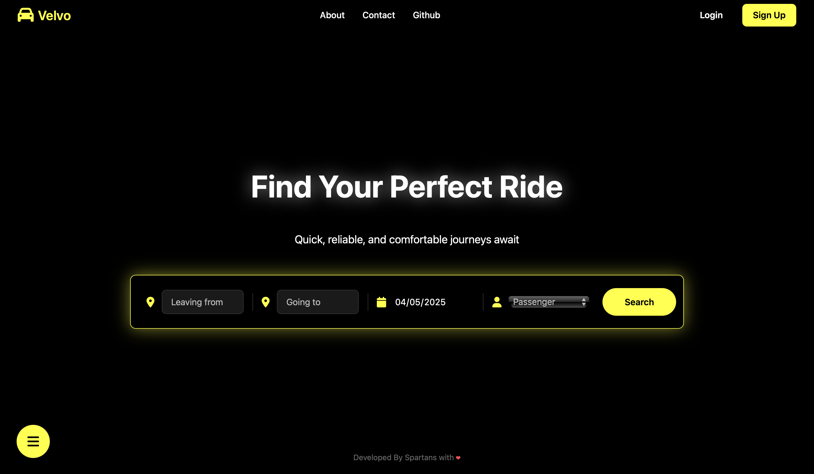
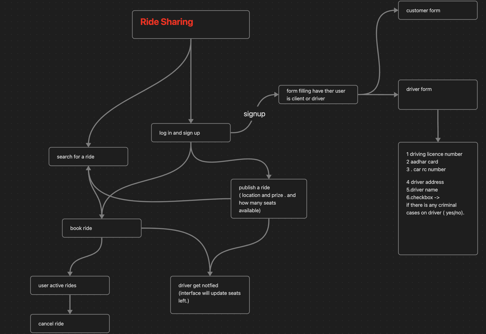

# Velvo
### Ride-sharing options often lack coordination, leading to inefficiencies in carpooling and underutilization of vehicles. A platform is needed to connect users for carpooling and ride-sharing, reducing costs and environmental impact.
## Preview - [Visit Our Website](velvo.great-site.net)

## Data Flow Diagram

## Project Structure
├── public

│   ├── index.html          # Main HTML file for the application

│   ├── login.html          # Login page for users

│   ├── signup.html         # Signup page for new users

│   ├── css

│   │   └── styles.css      # Stylesheet for the application

│   ├── js

│   │   └── search.js       # JavaScript file for handling search functionality

│   ├── backend

│   │   ├── .htaccess       # Configuration for backend access

│   │   ├── auth

│   │   │   ├── check_session.php  # Checks if user is logged in

│   │   │   ├── login.php          # Handles user login

│   │   │   ├── logout.php         # Handles user logout

│   │   │   └── signup.php         # Handles user signup

│   │   ├── config.php       # Database configuration and common functions

│   │   ├── customer

│   │   │   ├── book_ride.php          # Handles ride booking for customers

│   │   │   ├── cancel_booking.php      # Handles booking cancellation

│   │   │   ├── get_active_bookings.php # Retrieves active bookings for customers

│   │   │   ├── get_booking_history.php  # Retrieves booking history for customers

│   │   │   ├── get_customer_profile.php  # Retrieves customer profile information

│   │   │   ├── get_dashboard_counts.php  # Retrieves dashboard counts for customers

│   │   │   ├── get_recent_activity.php   # Retrieves recent activity for customers

│   │   │   └── search_rides.php          # Searches for available rides

│   │   ├── driver

│   │   │   ├── get_active_rides.php      # Retrieves active rides for drivers

│   │   │   ├── get_booking_requests.php    # Retrieves booking requests for drivers

│   │   │   ├── get_dashboard_counts.php    # Retrieves dashboard counts for drivers

│   │   │   ├── get_driver_profile.php      # Retrieves driver profile information

│   │   │   ├── get_ride_history.php        # Retrieves ride history for drivers

│   │   │   ├── publish_ride.php            # Handles publishing new rides

│   │   │   └── update_booking_status.php    # Updates the status of bookings

│   │   └── .htaccess       # Configuration for backend access

│   └── .htaccess           # Configuration for public access

│

├── README.md               # Project documentation
